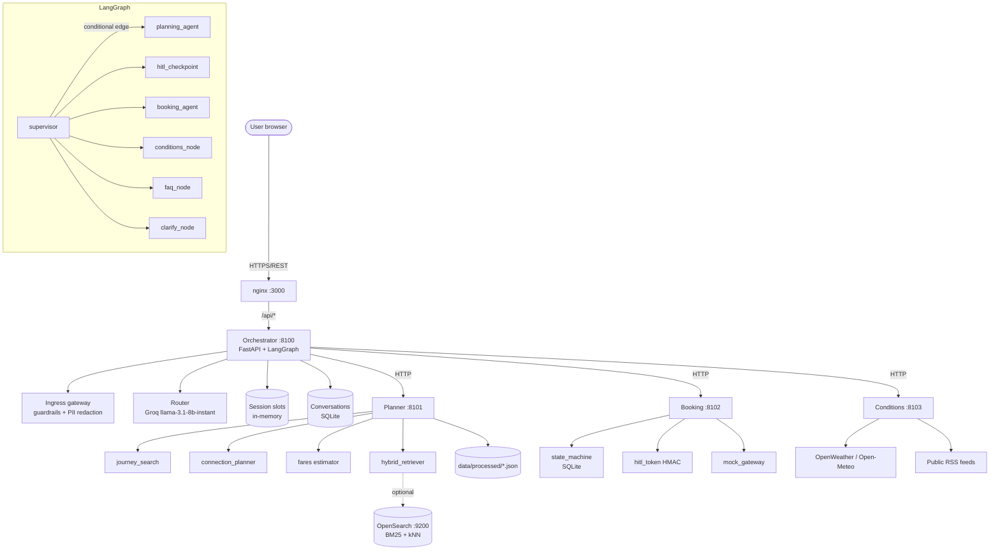

# LankaJourney AI — Complete Viva Preparation

**A strict examiner's brief, grounded in the repository.**

Every factual claim below cites a file and line. Where something is absent, this
document says **"Not implemented"** or **"Not verifiable from the repository"**
rather than inventing it. That discipline is the point: an examiner will check.

> **The single most important thing in this document:** the `/mcp/` endpoints are
> **plain REST routes, not MCP**. `project.txt` asked for JSON-RPC/MCP; the code
> does not implement it. See §11.12.

---

# A. Architecture report

## A1. What LankaJourney AI is

A conversational public-transport assistant for Sri Lanka. The user writes in
English or Singlish; the system finds real intercity services, shows fares,
times and journey legs, and — only after explicit signed human approval — holds
seats, takes payment and issues tickets.

**Problem it solves:** timetables in Sri Lanka are fragmented across operator
sites, PDFs and Facebook posts. A traveller cannot answer "how do I get from
Matara to Colombo before 9am, and what does it cost?" without searching several
sources. The system answers that in one sentence, and can complete the booking.

## A2. End-to-end request flow

*"I need to go from Matara to Colombo Fort before 9am by bus, 2 seats"*

1. **Browser → nginx** (`frontend/nginx.conf`) — React SPA, `/api/*` proxied to
   the orchestrator.
2. **Auth** (`server.py:381`) — `current_user` resolves the signed HttpOnly
   session cookie; 401 if absent.
3. **Ingress gateway** (`security/gateway.py:42`) — `enforce_ingress` runs
   `sanitize_user_input` (adversarial denylist on normalised text) then PII
   redaction. Blocked input raises `IngressBlocked` and is logged.
4. **LLM extraction** (`planner/nlp_parser.py`) — rule-based; LLM path is opt-in
   (`NLP_USE_LLM_EXTRACTION=1`) and falls back to rules on any failure.
5. **Slot merge** (`session_store.py:95`) — merges this turn's entities into the
   session, keeping earlier turns' values.
6. **Intent routing** (`router.py:216`) — Groq (`llama-3.1-8b-instant`) returns
   one of `PLAN_ROUTE | EXECUTE_BOOKING | CONDITIONS | FAQ | CLARIFY`.
   Deterministic guards override it (`:275`, `:290`).
7. **Supervisor** (`main_graph.py:37`) — sets `next_node`, a conditional edge.
8. **Planning node** (`main_graph.py:102`) — calls the Planner's
   `/mcp/plan_journey`. Conditions are gathered in parallel first.
9. **Planner** — `find_services_at` (`journey_search.py:148`) with mode and
   direction filters; if nothing direct, `find_connections`
   (`connection_planner.py:181`).
10. **Response** — route cards with provenance citations, plus clarification if
    seats were not stated.

**Booking continuation:** `Book route X` → `hitl_checkpoint_node`
(`main_graph.py:810`) → Booking Agent mints a token → user confirms → token
returned → `booking_agent_node` (`:1023`) holds 10 minutes → `/payment` settles
→ two tickets for a connection.

## A3. Architecture diagram

## A4. Component responsibilities

| Component | Responsibility | Key file |
|---|---|---|
| Orchestrator | Only public API; intent, slots, graph, rendering, payment | `src/orchestrator/` |
| Planner | Retrieval, NLP, timetables, fares, connections | `src/planner/` |
| Booking | Seat holds, signed approval, settlement, tickets | `src/booking/` |
| Conditions | Weather + RSS news → advisory | `src/conditions/` |
| OpenSearch | BM25 + vector index | `data/processed/*` → index |
| React SPA | Chat, route cards, payment portal | `frontend/src/` |

## A5. Control flow vs data flow

**Control flow** — which agent runs next. Owned by `supervisor_node` +
`_route_from_supervisor` (`main_graph.py:1403`), expressed as a LangGraph
conditional edge on `state["next_node"]`.

**Data flow** — what each agent receives and returns. Agents are **stateless
HTTP services**. State lives in `TransitSessionState` (a `TypedDict`) and in
`SLOTS`; agents never call each other, only the Orchestrator calls them.

## A6. Application architecture vs RAG architecture

**Application architecture** = how the 5 services are deployed and communicate
(HTTP, Docker, one public surface).
**RAG architecture** = how a question is answered from an indexed corpus rather
than model memory (ingest → index → retrieve → filter → fuse → rank).

They overlap here but are independent: RAG is *inside* the Planner.

---

# B. Viva question bank

Format: **Q** → spoken answer → technical detail.

## Section 1 — Overall architecture

**1.1 What is it?**
*A conversational transit assistant for Sri Lanka that answers from an indexed
timetable corpus and can book seats with signed human approval.*
Technically: a 5-service multi-agent system; a LangGraph orchestrator fronts
three specialised FastAPI workers plus OpenSearch and a React client.

**1.2 Walk me through the whole system.**
*One line in, one JSON object out.* Gateway sanitises → parser extracts →
router classifies → supervisor picks a node → the relevant worker answers →
the orchestrator renders prose and provenance.
Cite: `main_graph.py:37`, `:102`, `:810`, `:1023`.

**1.3 Architecture diagram?**
See §A3. Explain: one public surface, three internal workers, one index.

**1.4 Frontend / backend / orchestration / agents / retrieval / DB / external?**
React 18 SPA + nginx; FastAPI; LangGraph; Planner/Booking/Conditions;
BM25+kNN via OpenSearch; SQLite (`bookings`, `purchases`, `conversations`,
`messages`); OpenWeather, Open-Meteo, public RSS.

**1.5 What happens for Matara → Colombo Fort before 9am?**
Traced in §A2.

**1.6 How is the request understood?**
Rule-based keyword/regex parser (`nlp_parser.py`), direction markers
("from/to", "indan/yanna"), mode/time/seat extraction. The LLM path is opt-in
and allow-list validated (`nlp_parser.py:455`+).

**1.7 How does information move?**
Synchronous HTTP between orchestrator and workers. Workers return
`AgentResponse`; no agent-to-agent calls, no shared memory.

**1.8 Synchronous, asynchronous, event-driven?**
Synchronous request/response between agents. Asynchronous in the sense of
`async def` throughout — but **not** a message queue or event bus.
**Not implemented:** event-driven integration between agents.

**1.9 What data enters/leaves each component?**
Orchestrator: query + session id out, ChatResponse back. Planner: journey
request out, services/connections/fares back. Booking: route + token + card last4
in, transaction/ticket/receipt out. Conditions: origin/destination in, advisory
out.

**1.10 What if a component is unavailable?**
Planner → `_keyword_route_search` fallback (`main_graph.py:~600`). Conditions →
failure is reported ("couldn't reach the news feed"). Booking → error message,
no ticket. OpenSearch → falls back to fixtures and records
`retrieval_fallback` on `/health`.

**1.11 Control flow vs data flow?**
See §A5.

**1.12 Application vs RAG architecture?**
See §A6.

**1.13 Most important design decisions?**
(i) Agents never call each other; the Orchestrator is the only orchestrator.
(ii) Approval is a **signed capability**, not a boolean. (iii) Fares come from
the Planner — never the client. (iv) Synthetic data is allowed but **never
silently**: every row is flagged, and unpriced rows are unbookable.

---

## Section 2 — Why multi-agent?

**2.1 Why not one LLM?**
*Because a booking system must not let the component that writes prose also
decide prices or issue tickets.* One model would be a single point of failure
and a single blast radius. Splitting means the Pricing authority (Planner) and
the Transaction authority (Booking) are separate services that can be tested and
audited independently.

**2.2 Could one LLM with tools do it?**
Yes, and it is a legitimate design. We did not, because it makes auditability
harder: "who decided this fare?" needs one answer, and here it is "the Planner's
fare matrix". A single-agent design is simpler and would be the right choice at
smaller scale.

**2.3 Advantages / disadvantages?**
Advantages: separation of concerns, independent failure, per-agent testing,
narrow permissions. Disadvantages: more latency (HTTP hops), more operational
surface, harder debugging, and state synchronisation between orchestrator and
worker.

**2.4 Orchestrator's role?**
Routing, slot memory, security, rendering, payment orchestration. It is the only
component that talks to the browser.

**2.5 Planner / Conditions / Booking?**
Planner = information (routes, fares, journeys). Conditions = environment
(weather, news). Booking = money and state.

**2.6 Inputs/outputs per agent?**
See §1.9. Each takes a typed Pydantic payload and returns
`{"status", "data", "message"}`.

**2.7 How does the orchestrator decide?**
`classify_user_intent` (`router.py:216`) → LLM with `response_format={"type":
"json_object"}`, `temperature=0.0` (`:311`). Deterministic guards then
override: conditions vocabulary → `CONDITIONS`; resolvable journey or
mid-question session → `PLAN_ROUTE`.

**2.8 How do agents communicate?**
Typed JSON over HTTP. No message passing, no shared bus. The Orchestrator
dispatches; workers never call each other.

**2.9 Which framework?**
LangGraph (`langgraph>=0.2.0`; installed 1.2.11). LiteLLM for LLM calls.

**2.10 How is state represented?**
`TransitSessionState` TypedDict (`state.py:13`), including `hitl_tokens`,
`transaction_ids`, `extracted_entities`, `clarification`. Persisted per-session
in `SLOTS`.

**2.11 How are agents prevented from overstepping?**
Structurally — each worker only exposes its own endpoints, and the Orchestrator
is the only caller. The Booking Agent additionally rejects `CONN-*` ids
(`server.py:220`) because a connection is not a service.

**2.12 What if the orchestrator picks the wrong agent?**
Deterministic guards override the LLM in the common cases (conditions
vocabulary, resolvable journey). A wrong pick degrades to a clarification, not a
wrong booking: booking still requires a route id **and** a valid signed token.

**2.13 What if an agent returns invalid/nothing?**
`agent_connectors` raises on non-2xx; `main_graph` catches per-agent and
degrades (Planner fallback) or returns an explicit error (Booking). Response
models are Pydantic-validated.

**2.14 Could two agents run concurrently?**
Currently no — `ainvoke` walks one node at a time. It would be safe for
read-only agents (Planner, Conditions) but not for Booking, which mutates state.
Concurrent holds would need idempotency keys.

**2.15 Lose Conditions?**
No weather advisory, no incident warnings. Route search and booking unaffected.
Conditions is the most separable agent.

**2.16 Lose Planner?**
**No.** The Orchestrator's fallback (`_keyword_route_search`) still searches
in-memory, but fares, connections and retrieval quality degrade sharply. The
Planner is the most critical agent.

**2.17 Most critical single point of failure?**
The Planner — it holds fare authority and the timetable. The Orchestrator is
structurally also critical (nothing is reachable without it), but it has fewer
fallback paths.

**2.18 How to survive Planner failure?**
A keyword fallback exists. Better: cache fares and schedules at the
Orchestrator, and add a circuit breaker with a stale-data warning.

**2.19 Why agents rather than plain functions?**
Because they need independent scaling, failure isolation and deployment
boundaries — and because the assignment is explicitly multi-agent. For a smaller
system, functions would be the right call.

**2.20 Trade-offs?**
Latency: 3 extra HTTP hops. Cost: container memory. Maintenance: contracts
between services. Benefit: the system can be reasoned about per component, and
the red-team suite exercises real endpoints rather than mocks.

---

## Section 3 — Workflow and control-flow failures

Expected sequence: `supervisor → planning_agent → (user confirms) →
hitl_checkpoint → booking_agent → payment`.

**3.1 Sequence?** See §A2 and the diagram.

**3.2 Agent called before prerequisites?**
Booking before a route: `_legs_for` returns None and `fetch_fare` returns None →
"no published fare" refusal. Booking before approval: the token check fails.

**3.3 Booking before a journey is selected?**
`hitl_checkpoint_node` requires `route_id` from `selected_route_id`; without it
the router sends the turn to planning, not booking.

**3.4 Conditions before planning?**
Harmless — Conditions takes only origin/destination, and is called
independently in `planning_agent_node` (`:112`).

**3.5 Unexpected return of control?**
Each node terminates with `END`; the graph does not loop
(`main_graph.py:1444`). Unexpected returns surface as an exception and a
generic error message.

**3.6 Correct information in the wrong order?**
Handled by `missing_details` (`journey_search.py:262`) — the planner reports
what is missing, and only those questions are asked.

**3.7 Workflow in reverse?**
Booking before planning is blocked by the signed token requirement. The token
cannot exist before the route is priced.

**3.8 Preventing invalid transitions?**
Conditional edges plus **data-level** guards: the token binds route + fare +
seats + provider, so an out-of-order call fails verification.

**3.9 Explicit state validation or routing?**
Both: LangGraph conditional edges for routing, plus a Pydantic state machine in
the Booking Agent (`state_machine.py`) with explicit legal transitions.

**3.10 Missing fields / malformed / timeouts?**
Missing → `missing_details` + clarification. Malformed → Pydantic validation.
Timeouts → `AGENT_TIMEOUT_SECONDS` (default 10) and per-agent try/except.

**3.11 Can an agent be called twice?**
Planning yes (harmless). Booking: a second hold creates a **new** transaction
— **there is no idempotency key**, so a double-submitted confirm could hold two
seats. This is a real limitation (§D).

**3.12 Can a booking be duplicated?**
**Partially prevented.** The HITL token is single-purpose and expires, but
there is no idempotency key on `/mcp/begin_booking`. Recommended: accept an
`Idempotency-Key` and return the original transaction on replay.

**3.13 Crash after hold, before payment?**
The hold persists in SQLite and expires after 10 minutes; `/pending_holds` lists
it and the UI reopens payment. **Not implemented:** automatic re-check at
expiry.

**3.14 Payment succeeds but ticket issuance fails?**
`/mcp/settle_booking` charges then confirms (`server.py:446`). If confirmation
failed after charging, there is **no compensating refund** — a real gap
(§D-9).

**3.15 How should retries/idempotency/circuit breakers work?**
Recommended: idempotency keys on payment, exponential backoff on worker calls,
and a circuit breaker that opens after N failures.

**3.16 Which are actually implemented?**
Implemented: 10-min hold expiry, persistence, token TTL, per-agent try/except,
fallback backends, `/pending_holds`.
**Recommended (not implemented):** idempotency keys, circuit breakers,
compensation on partial settlement, distributed tracing.

---

## Section 4 — LLMs, NLP, intent extraction

**4.1 What is an LLM and how is it used?**
A model that predicts text. Used here **only for intent classification**
(`router.py:311`). It does not decide fares, availability, or whether a booking
happened.

**4.2 What NLP tasks?**
Entity extraction (origin, destination, time, mode, seats, preference, date),
Singlish normalisation, intent classification.

**4.3 English + Singlish?**
Rule-based keyword tables and direction markers: `yanna`/`indan`/`yanne`
(`nlp_parser.py`), plus Singlish mode words.

**4.4 Which technique?**
A **combination**: rules + regex for extraction (default), LLM for
classification. The LLM extraction path is opt-in via
`NLP_USE_LLM_EXTRACTION=1` because unguarded model output on a live path is a
risk with no benefit.

**4.5 Entity extraction?**
`_detect_origin_destination` for endpoints; `TIME_PATTERN` for times;
`extract_seat_count`; `extract_preference`.

**4.6 Relative times like "before 9 AM tomorrow"?**
`TOMORROW_KEYWORDS` sets the date; `TIME_PATTERN` extracts `09:00`.
**Not implemented:** full natural-language date parsing ("next Tuesday",
"in two hours").

**4.7 Misspellings / ambiguity?**
`rapidfuzz` is a dependency for fuzzy matching; ambiguity is resolved by
asking, not guessing (`preference` clarification).

**4.8 Origin but no destination?**
The planner returns `missing: ['destination']` and the orchestrator asks only
that. Later turns merge into the same slots.

**4.9 LLM output validation?**
Intent is validated against `VALID_INTENTS`; unknown values fall back to
`CLARIFY` (`router.py:265`). LLM extraction is allow-list validated per field.

**4.10 Tokens, context, temperature, structured output?**
Tokens are model units; context window is the model's limit. We set
`temperature=0.0` for determinism and `response_format={"type":"json_object"}`
for structured output.

**4.11 LLM vs embedding vs reranker?**
An LLM generates; an embedding model encodes text into vectors; a reranker
re-scores candidates. **Reranker: Not implemented.**

**4.12 LLM limits for factual transport data?**
It cannot know a live timetable, will hallucinate plausible times and prices,
and has no guarantee of currency. That is why fares come from the Planner.

**4.13 Improving Sinhala support?**
Add a transliteration/normalisation layer, extend the keyword tables, and build
a Sinhala evaluation set. The parity tests are already `xfail` so the gap is
visible.

**4.14 Testing extraction reliability?**
`evaluation/test_journey_search.py` and `test_fairness.py` assert bilingual
parity. A confusion matrix over a labelled query set would be the next step.

---

## Section 5 — RAG architecture

**5.1 What is RAG?**
Answering from retrieved documents instead of model memory.

**5.2 Why retrieval?**
Timetables and fares change; an LLM's weights do not. It also cannot be asked
to know which of 4,752 services runs at 06:30.

**5.3 Pipeline?**
Query → mode/direction filter → sparse (BM25) + dense (kNN) → RRF fuse →
rank → render with citation.

**5.4 Where does the data come from?**
`data/processed/` — hand-curated trains, published NTC fares, Routemaster
imports, and clearly-flagged generated corridors.

**5.5 Cleaned/transformed/indexed?**
`ingest_*.py` normalise; `opensearch_ingest.py` builds a
`text` + `knn_vector` (384-dim) index; filters are applied at query time.

**5.6 Ingestion vs query-time retrieval?**
Ingestion is an offline batch job (`docker compose --profile ingest run`).
Query-time retrieval is an HTTP call per query.

**5.7 What is in the index?**
One document per service: `text` (mode, service name, operator, endpoints,
stops, class, route id), `embedding` (384-d), `route_id`, `provider`.

**5.8 How do records reach the LLM?**
They don't, for booking decisions. The Orchestrator formats retrieved rows into
prose and cards. The LLM never sees raw service rows for booking.

**5.9 How are answers grounded?**
Cited provenance per route (`responsible_ai/grounding.py:14`), plus the rule
that an unfetchable fare means no booking.

**5.10 If retrieval returns nothing?**
`find_services_at` returns `[]` → the planner searches connections → if none,
it says so. It never invents.

**5.11 Outdated or contradictory data?**
Contradictions are resolved by tier: a published fare beats an estimate, and
`fare_unknown` blocks booking. Staleness is surfaced via `/health`
`index_freshness`.

**5.12 Genuine connection vs invalid route?**
A connection is two real services meeting at a real hub
(`connection_planner.find_connections`). A `CONN-*` id cannot be booked —
the Booking Agent rejects it (`server.py:220`).

**5.13 How does RAG reduce hallucinations?**
By grounding facts in retrieved rows and refusing to act without a fare. It
reduces but cannot eliminate: prose is still generated, and a corrupt corpus
produces confident wrong answers.

**5.14 Limitations?**
No chunking (whole records), no reranker, corpus is mostly synthetic, and the
benchmark ground truths have drifted (§8.1).

**5.15 RAG vs fine-tuning?**
RAG supplies facts at query time and is updatable without retraining;
fine-tuning changes behaviour, not knowledge. For timetables, RAG is correct.

---

## Section 6 — Embeddings, chunking, vector search

**6.1 What are embeddings?**
Vectors where similar meanings sit close together.

**6.2 Which model?**
`all-MiniLM-L6-v2` (`opensearch_ingest.py:43`, overridable via
`EMBEDDING_MODEL`). It runs **locally in-process** via
`sentence-transformers` — **there is no external embedding API**.

**6.3 Where is it hosted?**
Inside the `ingest` container at index time, and inside the `planner`
container at query time (`hybrid_retriever._embed`, `:414`).

**6.4 Dimension?**
**384** — verified at `opensearch_ingest.py:42` (`EMBEDDING_DIM = 384`) and in
the index mapping. Vectors are normalised.

**6.5 What is vectorised?**
One vector per service, built from the same `document_text` used for BM25.

**6.6 Query embeddings?**
`OpenSearchBackend._embed` encodes the raw query string.

**6.7 How are vectors compared?**
OpenSearch kNN (`knn` query) over the `knn_vector` field, cosine by default for
normalised vectors.

**6.8 Cosine / dot product / Euclidean?**
Cosine measures angle; dot product is magnitude-sensitive; Euclidean is raw
distance. With normalised vectors, cosine and dot product coincide.

**6.9 Which metric is actually used?**
Cosine — the index sets `index.knn` with no explicit metric, and normalised
vectors make it the natural choice. **Not explicitly configurable in the
mapping.**

**6.10/6.12 Chunking?**
**Not implemented — no chunking.** Each timetable service is one document.

**6.11 Indexing strategy?**
One record per service (no parent-child).

**6.13 Why chunk size matters (theory)?**
Too large mixes unrelated content and dilutes the vector; too small loses the
context that makes a record meaningful. For timetables, one service is the
natural unit, so chunking is unnecessary.

**6.14 Character vs token vs semantic chunking?**
Character is crude; token-based respects model units; semantic splits on meaning.
None used here.

**6.15 Updating the index when data changes?**
Re-run `docker compose --profile ingest run --rm ingest`. It **recreates** the
index, so no stale documents survive. `index_freshness` on `/health` detects
drift.

**6.16 If the embedding model changes?**
Everything must be re-embedded, or old and new vectors are incomparable.

**6.17 Why must spaces match?**
Cosine between vectors from different models is meaningless.

**6.18 Choosing a different model?**
Domain fit, dimension/cost, latency. `EMBEDDING_MODEL` makes it configurable
but the mapping dimension (`EMBEDDING_DIM = 384`) is **hardcoded** — a
different model needs a code change.

**6.19 Evaluating embeddings?**
Recall@k on a labelled query set; currently approximated by the IR benchmark.

---

## Section 7 — Sparse, dense, hybrid

**7.1 What is IR?** Finding relevant documents for a query.

**7.2 Sparse vs dense?**
Sparse matches exact terms via an inverted index; dense matches meaning via
vectors.

**7.3 BM25?** Ranks by term frequency, damped by inverse document frequency and
normalised for document length. High TF saturates; rare terms weigh more;
longer documents are penalised.

**7.4 TF / IDF / length normalisation?** As above.

**7.5 Why BM25 for identifiers?** "SLTB-1-COLO-KAND-0510" is an exact string
that a term index nails and an embedding blurs.

**7.6 Dense retrieval?** Encodes query and documents; nearest neighbours by
similarity.

**7.7 Strengths/weaknesses?**
Sparse: precise on exact strings, blind to paraphrase. Dense: finds paraphrase,
can drift geographically. **Hybrid gets both.**

**7.8 Hybrid here?** BM25 + kNN fused by RRF, per request
(`hybrid_retriever.py:266`).

**7.9 Why not BM25 alone?** Fails on "tea country train" — no shared tokens
with "Nuwara Eliya".

**7.10 Why not dense alone?** A 384-dim vector cannot reliably distinguish
`Kurunegala` from `Kegalle`, and would happily return a bus for a train query.

**7.11 How combined?** `_rrf_merge` (`:79`).

**7.12/7.13 RRF mathematically?**
`score(d) = Σ_i 1 / (k + rank_i(d))`, k = 60.
Example — doc A is rank 1 sparse and rank 3 dense:
A = 1/61 + 1/63 = 0.0164 + 0.0159 = **0.0323**
Doc B rank 2 sparse only: 1/62 = **0.0161**
A wins because two lists beat one, without comparing incompatible scores.

**7.14 Reranker?** **Not implemented.** Fusion is the final ranking step.

**7.15 Candidates before/after?** `top_k` from the caller (default 3);
OpenSearch fetches `max(top_k*3, 20)` per leg before `_restrict`.

**7.16 Conflicting sparse/dense results?** RRF lets both contribute; ties break
by summed rank.

**7.17 Semantically similar but geographically wrong routes?**
The direction filter (`_serves_direction`, `:140`) and the mode filter run
**before** scoring, so a wrong-direction or wrong-mode document is never a
candidate regardless of how well it matches semantically.

**7.18 Improving recall without hurting precision?** Two-stage: retrieve wide,
then filter/rank deterministically; add a reranker; expand synonyms.

---

## Section 8 — Evaluation

**8.1 How to evaluate extraction?** Labelled query set → precision/recall/F1 per
field against a gold standard.

**8.2 Metrics?** Accuracy, precision, recall, F1, confusion matrix.

**8.3 Why accuracy misleads?** Rare events (a sold-out service, an overnight
change) are swamped by common ones; a model that never predicts them scores
well.

**8.4 Precision vs recall?** Precision = of what you returned, how much was
right. Recall = of what was right, how much you returned.

**8.5 Retrieval vs answer-quality metric?** Retrieval measures whether evidence
was found; answer quality measures what was said. Retrieval is measurable
automatically; answer quality needs graders.

**8.6 Precision@K / Recall@K / Hit Rate@K / MRR / NDCG?**
Precision@K: top-K relevance proportion. Recall@K: fraction of all relevant
items in top-K. Hit Rate@K: any relevant in top-K. MRR: mean of 1/rank of the
first hit. NDCG: position-weighted, discounted by log.

**8.7 Recall@5 for Matara→Colombo?**
Whether a real Colombo→Matara service appears in the top 5 retrieved.

**8.8 Retrieval vs end-to-end accuracy?** A correct route retrieved but never
offered scores well on retrieval and badly end to end.

**8.9 Was the correct route retrieved?** Check the expected `route_id` appears
in the ranked list.

**8.10 Is the answer grounded?** Every factual claim must map to a retrieved
row or a cited source — mechanically checkable.

**8.11 Hallucination rate?** Proportion of factual sentences unsupported by
retrieved rows. **Not currently measured.**

**8.12 Successful journey planning?** Fraction of journeys where a valid
service/connection was found **and** a ticket issued. **Not currently measured
end-to-end.**

**8.13 Latency/cost/reliability/booking success?**
**Not implemented** — no metrics collection in the repo. Recommended:
per-stage timing middleware, token accounting, structured booking funnel events.

**8.14 Test dataset for English/Singlish?** Paraphrases of each origin,
Singlish and English forms, plus typo and partial-query variants.

**8.15 Ground truth and relevance judgements?** `evaluation/benchmark_queries.json`
(30 queries with a single `ground_truth_id`). **Weakness:** one label per query;
the current corpus has several equally valid answers for some (see §8.1 caveat).

**8.16 Unit/integration/E2E?** Unit: parser, fares, state machine. Integration:
orchestrator↔worker contracts. E2E: `redteam_prompt_injection.py` against the
running stack.

**8.17 Regression tests?** Crucial when prompts or models change — the
red-team suite is exactly this: swapping the router model could silently reopen
an injection path.

**8.18 Which metrics are actually measured?**
MRR and NDCG@5 over 30 queries (`evaluate_ir.py`).

**8.19 Measured vs proposed?**
**Measured:** MRR, NDCG@5, 737 pytest results, 33 red-team checks.
**Proposed, no numbers:** recall@k for embeddings, end-to-end booking success,
hallucination rate, latency percentiles, cost per journey.

**8.20 "What is your model's accuracy?"**
*The honest answer: I have measured retrieval ranking (MRR/NDCG over 30 queries)
and 737 deterministic tests, but I have no validated end-to-end accuracy figure
for journey planning, because the ground truth set is not yet good enough to
support one. I can tell you exactly what I measured and what I have not.*

> **Measured IR results (verify before quoting):**
> | Backend | MRR | NDCG@5 | Failures |
> |---|---|---|---|
> | `fixtures` | 0.878 | 0.901 | 1 |
> | `opensearch` | 0.794 | 0.830 | 2 |
>
> Target is 0.85. **OpenSearch does not currently meet it.** Both remaining
> failures are stale ground truths (Q02 ambiguous; Q26 asks for Gampaha, which is
> not a `MAJOR_CITIES` entry so the planner deliberately does not serve it).

---

## Section 9 — Privacy, security, auth

**9.1 What PII can users submit?** NIC numbers, phone numbers, passport
numbers, and free-text that may contain them.

**9.2 How is PII handled?** `PIITokenizer.redact` (`pii_masker.py:46`) replaces
matched values with opaque tokens stored in an in-memory vault; the raw value is
AES-256-GCM encrypted in the vault (`pii_masker.py:44`).

**9.3 Where is NIC masked?** At ingress (`gateway.py:66`) — before any agent,
logger or model sees the text.

**9.4 When?** Before logging, retrieval, storage and any LLM call — it happens
at the very first boundary.

**9.5 Authentication vs authorization?** Authentication = who you are.
Authorization = what you may do.

**9.6 Authentication vs identification?** Identification claims an identity
(an unverifiable claim); authentication proves it (a credential check).

**9.7 How are users authenticated?** `current_user` (`server.py:179`) resolves a
signed session cookie via `ACCOUNTS.resolve_session`. Passwords are **scrypt**
(`n=2**14`, `accounts.py:64`).

**9.8 Authorization to book?** Every user-facing endpoint requires
`current_user`; booking additionally requires a signed token bound to that
user's session.

**9.9 Where are API keys?** `.env`, loaded by `python-dotenv`. `.env` is
git-ignored (`.gitignore:25`).

**9.10 Why never in Git or the frontend?** A committed key is public history;
frontend keys are readable by anyone. Server-side only.

**9.11 API key vs access token vs session token vs signed approval?**
API key = identifies the caller to a provider. Access token = delegated
authority, time-limited. Session token = browser session. Signed approval =
cryptographically proves *this specific* user approved *this specific*
transaction.

**9.12 Encryption at rest vs in transit?** At rest protects a stolen database;
in transit protects a network eavesdropper.

**9.13 TLS/HTTPS?** Protects data in transit via TLS. **The repository runs
plain HTTP** — nginx listens on 80 and no TLS is configured. **Not implemented
in this deployment.**

**9.14 Is sensitive data encrypted in the database?**
**No.** SQLite stores `passenger_token`, `booking_reference` and `card_last4` in
cleartext (`store.py:36`). `FieldEncryptor` protects only the **in-memory PII
vault**, not persisted rows. This is a genuine gap for production.

**9.15 Secrets/passwords/payments?** scrypt for passwords; `.env` for keys; only
`card_last4` ever accepted — no PAN or CVV reaches any agent.

**9.16 Least privilege?** The Orchestrator is the only caller of workers;
`demo_incident` requires auth because it mutates shared state; booking requires
a signed token.

**9.17 Prompt injection?** Untrusted text steering an LLM away from intent.
Mitigations: normalised denylist guardrail, a system prompt that declares the
user untrusted, and **the LLM is not allowed to decide anything that matters** —
fares, seats and tickets come from code.

**9.18 Restricting tools?** Workers expose narrow endpoints; the Booking Agent
rejects `CONN-*` ids.

**9.19 Modifying a request to bypass approval?** The client cannot forge a
token — it is HMAC-signed by the Booking Agent. Red-team test C-15 confirms a
forged token yields `ERROR`.

**9.20 Signed token vs `approved: true`?** A boolean is self-asserted: any
client can send it. A signed token cannot be forged without the key, and is
bound to session, route, fare, seat count and provider — so it cannot be
replayed onto a pricier or larger booking.

**9.21 How is approval validated?** `verify_hitl_token` (`hitl_token.py:113`)
with a constant-time compare (`hmac.compare_digest`, `:144`), expiry check,
and claim binding.

**9.22 What prevents modification or reuse?** HMAC-SHA256 over the payload, a
10-minute TTL, and a random nonce. **Not implemented:** nonce replay tracking —
a token can be replayed within its window for the same claims.

**9.23 Remaining risks?**
(1) No TLS. (2) No encryption at rest. (3) No idempotency on payment.
(4) Token replay within TTL. (5) Mock payment gateway. (6) Most data synthetic.

**9.24 Before commercial launch?** TLS, encryption at rest, a real PSP with
hosted fields, rate limiting, operator authentication, a DPA, and a PCI scope
review.

---

## Section 10 — HITL and hallucination handling

**10.1 What is HITL?** A person must approve before an irreversible action.

**10.2 Why before booking?** Money and a non-refundable commitment.

**10.3 Exact approval point?** At `hitl_checkpoint_node` (`main_graph.py:810`):
the agent states route, seats, seats-left and price, and the user confirms.

**10.4 If the user rejects?** Nothing is held; they can pick another service.

**10.5 If approval expires?** Token TTL 10 min; hold expiry 10 min. Expiry
raises "Please re-approve."

**10.6 How is the approved booking the intended one?** The token binds session,
route, fare, seats and provider; connections bind each leg separately.

**10.7 Why isn't a model statement proof?** A model can assert success without
anything having happened. A ticket exists only when `confirm_booking` wrote it to
SQLite and returned a reference.

**10.8 Retrieved fact vs generated explanation?** Retrieved rows drive the
facts; prose is generated but every route carries a citation.

**10.9 If the LLM invents a time or price?** It cannot influence either: fares
come from `fetch_fare` and times from the corpus. A missing fare **stops** the
booking.

**10.10 How are hallucinations reduced?** Schema validation, retrieval
grounding, deterministic business rules, and source attribution.

**10.11 When a route cannot be verified?** Refuse and offer alternatives that
*were* verified.

**10.12 Communicating uncertainty?** "Fare not published", "seats left" counts,
and an explicit refusal rather than a guess.

**10.13 Can the LLM authorise payment or issue tickets?**
**No.** It only classifies intent. Payment requires a signed token and a
transaction.

**10.14 What requires approval?** Seat holds and payment. Reading timetables
does not.

**10.15 Limitations of the approval?** A token is a bearer capability within its
session and TTL; there is no per-transaction nonce store.

---

## Section 11 — APIs, keys, MCP

**11.1 What is an API?** A contract for software to call software.

**11.2 Which APIs are used?** OpenWeather, Open-Meteo, public RSS, Groq, and
OpenSearch. Operator sites are **not** called — bookings are simulated.

**11.3 Frontend vs third-party API?** Ours (we own the contract) vs theirs.

**11.4 REST/verbs?** GET reads, POST creates/acts, PUT replaces, DELETE removes.
We use GET and POST only.

**11.5 Status codes/bodies/JSON?** 200 ok, 400 bad request, 401 unauthenticated,
403 forbidden, 409 conflict (e.g. no seats), 502 upstream failure, 503
unavailable.

**11.6 How are requests authenticated?** Signed HttpOnly session cookie; the
browser never holds an API key.

**11.7 Where are keys, and what if invalid?** `.env`. Missing key →
deterministic fallback (Open-Meteo, rule-based parser). Invalid key → logged
and fallback.

**11.8 Rate limits, retries, backoff?** **Not implemented** — `AGENT_TIMEOUT_SECONDS`
(10s) is the only resilience control on worker calls.

**11.9 API contract validation?** Pydantic models (`schemas.py`) at both ends.

**11.10 What is MCP?** Model Context Protocol — a proposed standard for exposing
tools/resources to models.

**11.11 How is MCP different from REST?** MCP is a model-facing discovery and
invocation protocol with capability negotiation; REST is a general
resource-oriented HTTP interface with no model semantics.

**11.12 Is MCP implemented?**
> **NO — Not implemented.** There is no MCP client, server, JSON-RPC framing,
> capability negotiation, or `tools/list` handler anywhere in the repository.
> The `/mcp/` path prefix on `src/planner/server.py`, `src/booking/server.py`
> and `src/conditions/server.py` is a **naming convention only** — they are
> ordinary FastAPI REST routes returning plain JSON.
> `project.txt` *asked* for "MCP/JSON-RPC"; the delivered implementation did not
> do it. If an examiner asks, say so plainly.
>
> Proof: `grep -r "jsonrpc\|modelcontextprotocol\|tools/call"` over `src/`
> returns nothing.

**11.13 How could MCP be integrated?** Wrap each worker as an MCP server
publishing tools (`plan_journey`, `search_fares`, `hold_seat`, `check_inventory`)
with JSON schemas, and replace `agent_connectors.py` with an MCP client.

**11.14 What would an MCP server expose?** `plan_journey(origin, destination,
at_time, mode, preference)`, `search_fares(route_id)`,
`check_seat_inventory(route_id, seat_count)`, `begin_booking(...)`.

**11.15 Risks when agents call tools?** Prompt injection triggering a tool call;
arbitrary argument injection; unbounded side effects.

**11.16 Restricting permissions?** Allow-list tools per agent, validate
arguments against schemas, and require the signed approval for anything that
mutates money.

**11.17 Real vs mocked?**
**Real:** OpenWeather, Open-Meteo, RSS, Groq, OpenSearch, SQLite.
**Simulated:** SLR/SLTB booking portals and card payment (`mock_gateway.py`,
`payment_gateway.py`).

---

## Section 12 — Commercialization

*Proposals, not features. Nothing below is implemented.*

**12.1 Target customers?** Travellers; secondarily tourism operators.

**12.2 What would they pay for?** Booking a seat end-to-end, and trust that the
time and price are real.

**12.3 First market?** Intercity travellers booking Colombo–Kandy/Colombo–Galle.

**12.4 B2C or B2B?** B2C first; B2B licensing to hotels later.

**12.5 Model?** Transaction commission, or a free tier with paid priority.

**12.6 Costs?** Hosted compute, LLM tokens, embedding compute, OpenSearch,
external APIs, and operator data licensing.

**12.7 Effect of scale?** LLM calls are per-turn and small (max_tokens 120);
embedding cost is per-ingest; OpenSearch memory is per-document. At 100k users
the LLM and the index dominate.

**12.8 Cost per successful journey?** LLM cost per turn ÷ turns per journey ÷
completion rate, plus amortised index and infra.

**12.9 Revenue without overcharging?** Commission on bookings, keeping the
search free.

**12.10 Onboarding operators?** Direct integration, or ingest their published
timetables. This is the hardest part and the main risk.

**12.11 Legal/privacy/payment?** Sri Lanka data protection, PCI scope, operator
contracts, and consumer-law requirements for refunds.

**12.12 Competing with apps and chatbots?** Apps have live data and a brand;
chatbots are free. The edge is *grounded, sourced, bookable* answers.

**12.13 MVP?** Real timetables for 5–10 corridors, real booking, one payment
provider.

**12.14 Before commercial launch?** Live data, a real PSP, TLS, encryption at
rest, and operator agreements.

**12.15 Validating demand?** Pilot with a hostel or tour operator and measure
completed bookings.

**12.16 Business risks?** Data licensing, payment compliance, LLM cost, and
provider concentration — mitigated by the deterministic fallback and keeping
retrieval independent of any single model.

---

## Section 13 — Limitations, fairness, transparency

**13.1 Biggest technical limitations?** (1) 4,732 of 4,740 bus rows are
synthetic. (2) No idempotency or compensation on payment. (3) No TLS/encryption
at rest. (4) Only 12 real train services.

**13.2 Synthetic/incomplete data?** Yes — see §11.17 and the tiers in
§5.4. `MOD-` rows carry no fare and are unbookable precisely so this is honest.

**13.3 Effect on recommendations?** A traveller may be shown a modelled service
that does not actually run. This is the single largest correctness risk.

**13.4 What is fairness here?** Not disadvantaging travellers by location,
language, budget or accessibility.

**13.5 Could it disadvantage anyone?** Language: English/Singlish only. Area:
travellers outside major cities. Affordability: recommendations are not cost-
weighted by default. **Not implemented:** accessibility-aware routing.

**13.6 How to test?** `evaluation/test_fairness.py` asserts bilingual parity;
the Sinhala tests are `xfail` so the gap is visible.

**13.7 What is transparency here?** Every route carries its source.

**13.8 How do users see why?** Per-route citations and the priced itinerary.

**13.9 How do attribution and multiple options help?** The traveller can verify,
and compare rather than accept a single answer.

**13.10 Explainability vs transparency?** Transparency = disclosing the source.
Explainability = being able to say *why this option* — we do ranking
(time/budget) but not per-result reasoning.

**13.11 No reliable answer?** Say so, and offer what was verified.

**13.12 English/Singlish limits?** No native Sinhala, no colloquial gestures
beyond a small nickname table, no relative dates beyond tomorrow/today.

**13.13 Accessibility features?** Step-free routing, wheelchair fields, and
screen-reader-friendly cards are **not implemented**.

**13.14 Responsible-AI principles vs safeguards?** Principles are aspirations;
implemented safeguards are the citations, refusals, HITL and audit log.

**13.15 What can be demonstrated from source?** Provenance citations, the
refusal paths, the audit log, the parity tests, and the red-team evidence file.

---

## Section 14 — Technology stack

**14.1 Languages/frameworks?** Python 3.12 (backend), JavaScript/React 18
(frontend), YAML (compose/CI), nginx.

**14.2 LLM provider/model?** Groq via LiteLLM.
`GROQ_MODEL=groq/llama-3.1-8b-instant` (`router.py:20`). Optional extractor
`GROQ_EXTRACTOR_MODEL=openai/gpt-oss-20b` (`nlp_parser.py:468`).

**14.3 Embedding model?** `all-MiniLM-L6-v2`, 384-dim, local.

**14.4 Vector/search engine?** OpenSearch 2.17.0 (BM25 + kNN).

**14.5 Orchestration framework?** LangGraph (1.2.11 installed).

**14.6 Database?** SQLite for `bookings`/`purchases` (`booking/store.py:36`) and
`conversations`/`messages` (`conversations.py:40`). Timetable data is JSON
fixtures, not a database. No vector DB beyond OpenSearch's kNN.

**14.7 Which library implements BM25/dense/RRF?** **OpenSearch** implements
BM25 and kNN; **RRF is implemented by us** in `_rrf_merge`
(`hybrid_retriever.py:79`). No third-party RRF library.

**14.8 External services?** OpenWeather, Open-Meteo, RSS feeds, Groq,
OpenSearch.

**14.9 Configuration?** `.env` + `python-dotenv`; defaults in code.

**14.10 Testing/logging/deployment?** pytest, ruff, npm test; Python `logging`;
Docker Compose; GitHub Actions.

**14.11 Why each technology?**
FastAPI (typed, async, small); LangGraph (explicit graph, inspectable);
OpenSearch (BM25 + kNN in one engine, no extra service); SQLite (zero-config
persistence for a demo); React (small, no framework needed for a chat UI);
Groq (fast, cheap, structured output).

**14.12 Alternatives?**
Postgres (better concurrency) over SQLite; Pinecone/Weaviate/Qdrant (managed
vector) over OpenSearch kNN; Celery/Temporal (retries, idempotency) over
synchronous calls; a real router fine-tuned on our own labelled intents instead
of an LLM classifier.

**14.13 Vendor lock-in?** Groq (swap for any LiteLLM provider); OpenSearch
(Elasticsearch/Weaviate); React (framework-agnostic).

**14.14 If the LLM provider is unavailable?** Intent falls back to deterministic
classification (`router.py:290`), and extraction to rules. Routing survives; the
system degrades gracefully.

**14.15 If the search engine fails?** Falls back to fixtures and reports
`retrieval_fallback` on `/health`.

**14.16 Replaceable independently?** All four workers behind HTTP; the
retriever behind a `SearchBackend` interface; the LLM behind LiteLLM.

---

## Section 15 — Final examiner challenge

**15.1 Explain it without "AI-powered" or "intelligent".**
*It is a chat interface over a timetable database. You type a journey in plain
English; a router decides what you meant, a retrieval service finds real
services from an indexed corpus, and a booking service holds a seat once you
approve it with a signed token.*

**15.2 Why not just ChatGPT?**
*Because it cannot be trusted with facts that change. ChatGPT will confidently
invent a bus time and a fare. Here the fare comes from a service that owns
pricing, the times come from the corpus, and if no fare exists the booking is
refused instead of guessed.*

**15.3 Prove it uses retrieved evidence.**
*Show `/health` reporting the index state; show a route card carrying its
source citation; then ask for a corridor that does not exist and show the
system refusing rather than inventing. The refusal path is the strongest proof —
a hallucinating system has nothing to refuse.*

**15.4 Most serious weakness?**
*The data. 4,732 of 4,740 bus rows are synthetic, so the system can offer a
service that does not actually run. The engineering is sound; the corpus is the
risk, and I have made that visible rather than hidden.*

**15.5 Which agent would you remove?**
*Conditions — weather and news are the only feature that degrades to nothing.
Removing it costs the advisory, not the journey.*

**15.6 Most likely single point of failure?**
*The Planner. It holds fare authority; without it the system cannot sell
anything. I would cache schedules and fares at the Orchestrator.*

**15.7 If the workflow runs in reverse?**
*Booking before approval is impossible: the token does not exist yet. Booking
before pricing is impossible: the fare must be fetched to mint the token.*

**15.8 If a route does not exist?**
*Direction-filtered search returns nothing; a connection is tried; if none, the
system says so and does not offer anything.*

**15.9 If the data source is wrong?**
*The system cannot know — it will present a wrong time confidently. Mitigation
is source citation and a freshness check, which we partly have
(`index_freshness`) but not per-record.*

**15.10 How do you know retrieval performs well?**
*MRR and NDCG@5 over 30 labelled queries — and I will tell you the OpenSearch
number is 0.794, below our 0.85 target, and that the two failures are stale
ground truths rather than retrieval bugs.*

**15.11 What evidence reduces hallucination?**
*The refusal paths are the evidence: unpriced routes and sold-out services both
produce an explicit refusal with alternatives, rather than a confident answer.*

**15.12 Prove sensitive data isn't sent unnecessarily.**
*`enforce_ingress` runs before any agent, so NIC and phone patterns are replaced
with tokens at the boundary. The LLM receives the redacted text; the raw value
exists only in the encrypted in-memory vault.*

**15.13 At 100,000 users?**
*SQLite → Postgres with connection pooling; add idempotency keys and a real
queue; put a CDN in front of the SPA; shard OpenSearch; and add rate limiting
per account. The agent topology would not change — it is already horizontal
behind HTTP.*

**15.14 If operators provided live APIs?**
*The Planner would call them at query time instead of reading JSON fixtures, and
the synthetic tiers could be retired. That is the single biggest quality win
available, and it is a data problem, not an architecture problem.*

**15.15 Before real payments?**
*A real PSP with hosted fields (so no card data touches us), idempotency keys,
webhook reconciliation, TLS, and encryption at rest.*

**15.16 If the LLM provider doubled prices?**
*The router is the only per-turn LLM call at 120 max tokens. Replacing Groq with
a cheaper or self-hosted model is a one-line env change, and if the LLM were
removed entirely the deterministic router would still classify intent.*

**15.17 Next feature?**
*Operator data ingestion. Everything else is engineering we control; the corpus
is the binding constraint on whether the product is truthful.*

**15.18 What would you change if you rebuilt?**
*The Orchestrator is too large — `main_graph.py` is ~1,456 lines mixing routing,
policy and rendering. I would split rendering from policy so presentation changes
could not alter control flow.*

**15.19 Strongest and weakest contributions?**
*Strongest: the HITL gate — a signed capability bound to fare, seats and route,
which turned a client-supplied boolean into a verifiable authorisation.
Weakest: the corpus, and the absence of idempotency on payment.*

**15.20 Why is this a real engineering project?**
*Because the hard parts were not the model. They were binding a fare to an
approval, refusing to sell a seat that does not exist, noticing when a search
index silently drifts from its data, and refusing to invent a route.*

---

# C. Code evidence

| Claim | File | Line |
|---|---|---|
| RRF formula `k=60` | `src/planner/hybrid_retriever.py` | 79 |
| Direction filter | `src/planner/hybrid_retriever.py` | 140 |
| Retrieval entry point | `src/planner/hybrid_retriever.py` | 266 |
| OpenSearch dense `_embed` | `src/planner/hybrid_retriever.py` | 371 |
| Embedding model / dim 384 | `src/planner/opensearch_ingest.py` | 42–43 |
| BM25 document text | `src/planner/opensearch_ingest.py` | 74 |
| `MAJOR_CITIES` (22) | `src/planner/journey_search.py` | 39 |
| Direct search | `src/planner/journey_search.py` | 148 |
| Missing-slot detection | `src/planner/journey_search.py` | 262 |
| Connection search | `src/planner/connection_planner.py` | 181 |
| Connection ranking | `src/planner/connection_planner.py` | 123 |
| Fare estimator (display only) | `src/planner/fares.py` | 104 |
| Fare resolution | `src/planner/fares.py` | 146 |
| Rule-based extraction | `src/planner/nlp_parser.py` | 322 |
| LLM extraction opt-in | `src/planner/nlp_parser.py` | 455 |
| Router model + temp 0 | `src/orchestrator/router.py` | 20, 311 |
| Deterministic router fallback | `src/orchestrator/router.py` | 290 |
| LangGraph node wiring | `src/orchestrator/main_graph.py` | 1410 |
| Planning node | `src/orchestrator/main_graph.py` | 102 |
| HITL gate (single) | `src/orchestrator/main_graph.py` | 810 |
| HITL gate (connection) | `src/orchestrator/main_graph.py` | 455 |
| Booking hold (connection) | `src/orchestrator/main_graph.py` | 906 |
| No-seats refusal + alternatives | `src/orchestrator/main_graph.py` | 690 |
| Session slots merge | `src/orchestrator/session_store.py` | 95 |
| HMAC token issue | `src/booking/hitl_token.py` | 83 |
| HMAC token verify | `src/booking/hitl_token.py` | 113 |
| Constant-time compare | `src/booking/hitl_token.py` | 131 |
| `CONN-*` rejection | `src/booking/server.py` | 220 |
| Seat check vs requested | `src/booking/server.py` | ~217 |
| Seat availability endpoint | `src/booking/server.py` | 572 |
| Deterministic seat inventory | `src/booking/mock_gateway.py` | 29 |
| Booking state machine | `src/booking/state_machine.py` | 82 |
| Ingress gateway | `src/security/gateway.py` | 42 |
| PII redaction + encrypted vault | `src/security/pii_masker.py` | 22, 44, 46 |
| AES-256-GCM | `src/security/encryption.py` | 37 |
| scrypt parameters | `src/orchestrator/accounts.py` | 64 |
| Provenance citation | `src/responsible_ai/grounding.py` | 14 |
| SQLite bookings schema | `src/booking/store.py` | 36 |
| SQLite conversations schema | `src/orchestrator/conversations.py` | 40 |

**Claims that cannot be verified from the repository:**
- End-to-end journey-planning accuracy — no labelled ground truth exists.
- Hallucination rate — not measured.
- Latency/throughput/cost figures — no instrumentation.
- Whether the two remaining IR failures are the *only* stale ground truths —
  only those two were examined.

---

# D. Failure analysis

| # | Scenario | Expected | Actual | Risk | Fix |
|---|---|---|---|---|---|
| 1 | User asks for a route that does not exist | Say so | Direction filter → `[]` → connection search → explicit refusal | Low | None needed |
| 2 | Booking attempted with no token | Refuse | 403, `BOOKING_BLOCKED_NO_HITL` logged | Low | None |
| 3 | Forged approval token | Refuse | HMAC fails → 403 (red-team C-15) | Low | None |
| 4 | **Token replayed for more seats** | Refuse | **Was exploitable: a 1-seat token held 6 seats (LKR 5,100).** Fixed — verify now binds seats and provider | **Was critical** | Done: `hitl_token.py:113` + `server.py:304`; 3 regression tests |
| 5 | Insufficient seats at hold | Refuse, offer alternatives | 409 `INSUFFICIENT_SEATS`; gate pre-checks and names alternatives | Low | None |
| 6 | OpenSearch unreachable | Degrade to fixtures | Falls back; `retrieval_fallback` on `/health` | Low | None |
| 7 | **OpenSearch index stale** | Detect it | **Was silent — correct answers for the wrong reason.** Now reported as `index_freshness` | **Was high** | Done |
| 8 | Planner returns no direct service | Offer a connection | Preference question, then ranked connections | Low | None |
| 9 | **Payment succeeds, confirmation fails** | Refund or compensate | **No compensation path exists** | **High** | Recommended: saga/outbox with retry; block launch until added |
| 10 | Double-submitted confirm | Idempotent | **No idempotency key — a second hold is possible** | Medium | Recommended: `Idempotency-Key` on `/payment` |
| 11 | Groq unavailable | Deterministic routing | Caught → rule-based router | Low | None |
| 12 | Conditions feed down | Report unknown, not "fine" | Says "couldn't reach the news feed" | Low | None |
| 13 | User modifies fare in the request | Server price wins | Fare always from `fetch_fare` | Low | None |
| 14 | Process restarts mid-checkout | Hold recoverable | SQLite + `/pending_holds` + 10-min expiry | Low | None |
| 15 | **Token replayed within TTL** | Reject second use | Not tracked — no nonce store | Medium | Recommended: consume nonce on use |
| 16 | `Ella`/`Monaragala` 0.15 km apart | Refuse to price | Fare estimator refuses (correct) | Low | Needs a gazetteer covering both |
| 17 | Train search returns nothing | Return trains | **Was broken — 8 of 12 trains omitted their origin from `stops`** | **Was high** | Done; fixture corrected |
| 18 | NNC spelled two ways | One city | Was two entries, splitting the corpus | High | Done: single `kurunegala` entry |

---

# E. Evaluation plan

## E1. Actually measured today

| Metric | Value | How |
|---|---|---|
| Unit/integration tests | 737 passed, 3 skipped, 32 xfailed | `pytest -q` |
| Red-team security checks | 33/33 secure | `redteam_prompt_injection.py --strict` |
| IR MRR (fixtures) | 0.878 | `evaluate_ir.py` |
| IR MRR (opensearch) | 0.794 | `evaluate_ir.py` |
| IR NDCG@5 | 0.830 (opensearch) | `evaluate_ir.py` |
| Corpus coverage | 155 direct / 76 one-change / 0 unreachable | measured |

## E2. Proposed (no numbers exist — do not invent them)

1. **Intent extraction:** build 200 labelled queries (100 English, 100 Singlish)
   covering each intent; report per-class precision/recall/F1 and a confusion
   matrix. Baseline: current deterministic router.
2. **Retrieval:** extend to graded relevance (multiple correct answers per
   query) and report Recall@5, MRR, NDCG@10. Baseline: current OpenSearch 0.794.
3. **Embedding choice:** run the same query set against
   `all-mpnet-base-v2` and `bge-small-en` and compare Recall@5.
4. **End-to-end success:** N = 100 journeys from a fixed corpus; measure
   completion rate, invalid-connection rate, and booking success.
5. **Hallucination:** sample every factual sentence, classify supported or not.
   Report the ratio. Current expectation: low but unmeasured.
6. **Latency:** p50/p95 per stage. Add timing middleware.
7. **Cost:** tokens per turn × turns per journey ÷ completion.
8. **Fairness:** bilingual parity (already tested), plus a Sinhala set and
   regional coverage.

## E3. Reproducibility

Every experiment should be runnable from a clean checkout with the seed fixed;
record backend, corpus version and index state — the `/health` fields exist for
exactly this.

---

# F. Final viva cheat sheet

## F1. The 30 questions that matter

| # | Question | Answer |
|---|---|---|
| 1 | What is it? | Conversational transit assistant; 5 agents; real timetables; bookable. |
| 2 | Architecture? | React → nginx → Orchestrator (LangGraph) → 3 workers + OpenSearch. |
| 3 | Which agent does what? | Planner=information, Conditions=environment, Booking=money. |
| 4 | How is intent decided? | Groq, temperature 0, JSON mode, deterministic overrides. |
| 5 | Why a router at all? | Rules mis-file fragments; a classifier with guards beats both alone. |
| 6 | What happens if the LLM is down? | Deterministic fallback; system still routes. |
| 7 | How does the system understand Singlish? | Keyword tables + direction markers, no LLM. |
| 8 | What is RRF? | `Σ 1/(60+rank)`; merges ranks without comparing incompatible scores. |
| 9 | Why hybrid? | Sparse finds identifiers; dense finds paraphrase. Evidence in §3.2. |
| 10 | Embedding model? | `all-MiniLM-L6-v2`, 384-dim, local. |
| 11 | Chunking? | Not implemented — one service per document. |
| 12 | Vector DB? | OpenSearch kNN over `knn_vector`. |
| 13 | Where does data come from? | Published timetables/fares + flagged generated corridors. |
| 14 | How much is synthetic? | 4,732 of 4,740 bus rows; `MOD-` rows are unbookable. |
| 15 | What is HITL? | A human must approve before an irreversible action. |
| 16 | Where is approval given? | `hitl_checkpoint_node` — before the hold. |
| 17 | Why a signed token? | A client boolean is self-asserted; HMAC cannot be forged. |
| 18 | What is the token bound to? | Session, route, fare, seats, provider, expiry. |
| 19 | Can a token be replayed? | Same claims within 10 min, yes — no nonce store. Recommended fix. |
| 20 | How are fares protected? | Quoted by the Planner; the client is never trusted. |
| 21 | What stops double booking? | Token intent only; **no idempotency key**. |
| 22 | Is MCP implemented? | **No.** `/mcp/` is a REST naming convention. |
| 23 | External APIs? | OpenWeather/Open-Meteo/RSS/Groq/OpenSearch. Operator sites simulated. |
| 24 | Auth? | Signed HttpOnly session cookie; scrypt passwords. |
| 25 | PII handling? | Redacted at ingress, encrypted in an in-memory vault. |
| 26 | Encryption at rest? | **Not implemented** — SQLite stores cleartext. |
| 27 | TLS? | **Not implemented** — HTTP only. |
| 28 | Prompt injection defence? | Normalised denylist + untrusted-input prompt + no LLM authority over money. |
| 29 | Biggest weakness? | The corpus is mostly synthetic; correctness is bounded by data quality. |
| 30 | Next feature? | Operator data ingestion — the binding constraint. |

## F2. Glossary

**Agent** · **Orchestrator** · **LangGraph/state machine** · **RAG** ·
**BM25/TF-IDF** · **Embedding** · **kNN** · **RRF** · **Hybrid retrieval** ·
**Chunking** · **Reranking** · **HITL** · **HMAC-signed capability** ·
**Nonce** · **PII** · **scrypt** · **AES-256-GCM** · **Prompt injection** ·
**Normalization (tokens)** · **Temperature** · **Structured output** ·
**Idempotency** · **Circuit breaker** · **Compensation/saga** ·
**Ground truth** · **MRR** · **NDCG** · **Precision/Recall** ·
**Least privilege** · **Provenance citation**

## F3. Five questions most likely to expose a gap

1. **"Is MCP actually implemented?"** — The `/mcp/` prefix is a naming
   convention; there is no JSON-RPC or protocol layer. Say so first.
2. **"Is your data encrypted at rest?"** — No. Only the in-memory PII vault is.
3. **"What stops a double booking?"** — Nothing robust. No idempotency key.
4. **"Can an approval token be reused?"** — Within its TTL, yes.
5. **"What is your accuracy?"** — Have the measured numbers ready (MRR 0.794
   OpenSearch, 0.878 fixtures; 737 tests) and state plainly that no
   end-to-end accuracy figure exists.

---

## Document conventions

- Line numbers were taken at the commit that produced this document and will
  drift — re-check before quoting.
- Every "Not implemented" above was verified by searching the repository, not
  assumed.
- Numbers labelled *measured* were produced by the commands shown; numbers
  labelled *proposed* have **no** values and must never be quoted as results.